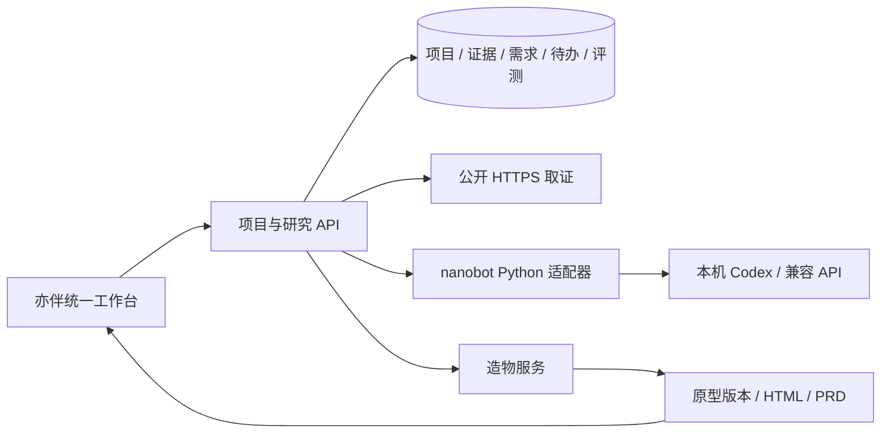

# 后续开发说明

当前实现保留两个服务，在亦伴上增加项目与研究层。这样可以继续使用造物现有的原型结构、迭代版本和导出，无需把两个数据库合并。用户从统一工作台操作，服务间请求只走本机地址。

## 修改位置

| 功能 | 文件 | 约定 |
|---|---|---|
| 工作台与交互 | `src/AgentApp.tsx`、`src/agent.css` | 默认新入口；`/?legacy=1` 保留旧版 |
| 项目、任务与关联 | `server/agent-router.mjs` | 每个项目同时最多一个执行任务；提交支持幂等键 |
| 公开取证 | `server/evidence.mjs`、`runtime/search.py` | 搜索结果仅提供 URL，事实来自实际抓取正文 |
| nanobot 运行 | `runtime/bridge.py`、`server/nanobot-runtime.mjs` | 固定上游版本；默认工具为空；调用原始记录私有保存 |
| 模型与计量 | 两个仓库的 `server/provider.mjs` | 保存最终输出与公开运行事件，过滤推理事件；缺用量为 null |
| 原型生成与版本 | 造物 `server/index.mjs`、`server/prompts.mjs` | 接收已存需求；输出独立 HTML 与 PRD |
| 评测 | `scripts/evaluate-agent.mjs` | 使用旧版提示与结构作基线；保存失败、补救、原文和复核记录 |

## API 入口

所有入口都继承工作空间的登录保护与跨站写入检查。下表省略 `/api/agent` 前缀。

| 入口 | 用途 |
|---|---|
| `GET /bootstrap` | 项目、运行、评测与运行状态 |
| `POST /projects`、`PATCH /projects/:id` | 建立项目、修改背景、确认或纠正记忆 |
| `POST /runs` | 研究或回忆，返回任务后异步执行 |
| `GET /runs/:id`、`POST /runs/:id/cancel` | 状态、原始记录与取消 |
| `POST /runs/:id/prototype` | 从本项目的已完成研究需求生成原型 |
| `PATCH /runs/:id/actions/:actionId` | 保存行动项完成状态 |
| `GET /runs/:id/export` | 研究记录、模型调用与证据快照包 |
| `GET /prototypes/:id/download` | 原型源码、需求和来源清单 |
| `GET /evaluations/:id/export` | 评测及配对样本原始记录 |

## 本机开发与复现

按主 README 安装并构建两个项目，再运行 `npm run agent:start`。前端源码修改后重新 `npm run build` 并刷新页面；服务端模块修改后需重新启动，正在执行的任务会被中断。先完成或取消任务，再重启。

`npm test` 使用隔离数据库与模型协议 fixture，不消耗真实额度。运行 `npm run agent:evaluate -- --data-dir data/personal-agent` 会真正调用模型，不能拿单元测试的 fixture 当评测成绩。

Node 依赖通过 `package-lock.json` 与 `npm ci` 复现。Python 上游提交固定，当前验证的间接依赖快照见 `runtime/requirements.lock.txt`；它是本机环境快照，不能替代其他平台的安装验证。模型路由、网络、运行顺序和输出随机性会影响重跑结果。

需要人工修正原型 HTML 时，可以执行 `node scripts/review-prototype.mjs RUN_ID HTML_FILE 修正说明`。它保留原版，分别在亦伴和造物保存新版本，明确标为 `manual`，不会发起模型调用。CLI 只用于本机验收；同项目正在执行任务时会拒绝写入。当前两个本机数据库没有跨库事务，写入出错后需检查两个版本记录再恢复。

## 后续优先级

1. 扩大固定任务池，加入矛盾证据、缺少来源和过时记忆；由独立审查者复核事实与需求可用性。
2. 增加记忆变更历史、撤销和来源有效期；当前纠正会更新现值，历史任务快照保留旧值。
3. 增加已保存证据的检索与选择，减少后续对话重复抓取；当前研究从本次抓取材料分析，回忆从项目背景与历史运行分析。
4. 有真实 API 授权后验证 API 路线及提供商原始用量，再接入有来源的价格表与账单对照。
5. 需要常驻跟进时再部署执行层和调度；当前待办是可保存的行动列表。

没有引入自动技能晋升、任意 Shell、多人账号或自动公开发布。它们需要另外的效果评测、授权与运行设计，不能从这一版演示推出已经具备。
