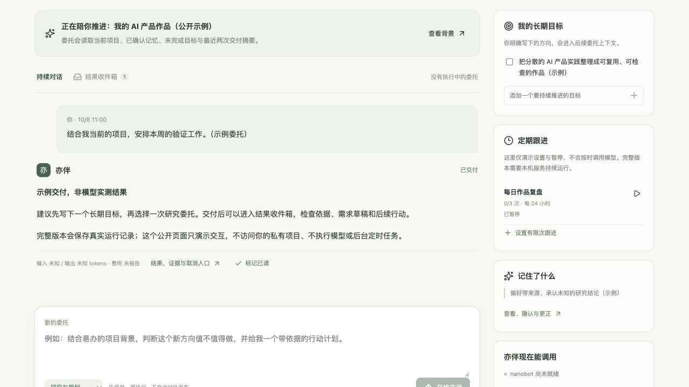
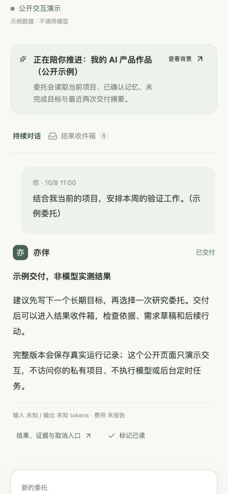

# 亦伴 v0.6：从项目工作台走向个人工作助理

2026-10-08。沿用 ai-pm-worker 和 nanobot 底座；造物通过既有独立服务调用。本轮只更新亦伴仓库，不修改客服实验室或造物代码。

[公开交互演示](https://yiheng-guo.github.io/ai-pm-worker/personal/) · [原版真实案例](https://yiheng-guo.github.io/ai-pm-worker/demo/) · [本机启动](PUBLIC_DEMO.md)

## 参考什么，以及取舍

官方参考：[xAI Grok Bot 介绍](https://x.ai/news/introducing-grok-bot)、[Grok Bot 文档](https://docs.x.ai/grok-bot/overview)、[Meta Muse](https://ai.meta.com/muse/)、[Muse 安全机制](https://research.meta.ai/blog/security-and-safety-for-ai-agents-our-approach-with-muse)。这里按 xAI Grok Bot 与 Meta Muse 理解产品名；若用户所指为同名其他产品，应重新核对参考对象。

借鉴持续对话、长期目标、后台委托、交付回收和可控授权。没有复制品牌、代码或宣传成绩，也没有声称实现相同的云电脑、应用生态或独立安全哨兵。亦伴当前定位为懂用户项目的个人工作助理；生活事务、跨应用写入和全天候执行不在本版能力范围。

## 实现

- **我的亦伴**成为本机默认入口；项目总览、研究、证据、需求、原型和评测继续可以跳转。
- **持续委托**：用户消息先持久化，再由本机队列交给真实 nanobot 执行；多个消息不丢写，同一项目忙时等待。排队可取消，已执行委托通过运行详情取消。
- **长期目标**：用户明确写入，最多20个未完成目标，可完成或重新打开。读取当前确认记忆；模型建议不自动写入。
- **对话上下文**：每个项目保持一个会话ID，带入未完成目标与最近两次交付摘要。不是无限上下文：目标每条前40字、历史委托前200字、回答前400字。完整消息与运行详情仍保存。
- **能力版本声明**：服务在每次运行提示中提供当前机制、权限和成本边界，防止旧背景文档覆盖新增能力。声明不是任务成功的证据。
- **结果收件箱**：成功、失败、取消都保留，支持已读状态。提供方报告的 Token 和费用照实呈现；未知不换算成零。
- **有限次定期研究**：用户显式启用、最小间隔60分钟、最多10次、最多5个启用任务；一次未结束不叠加。到达上限自动关闭，暂停不取消已经排队的委托。执行预算按排队次数计，即使失败也消耗一次授权。
- **恢复**：重启后队列持久化，按幂等键关联已保存运行；原执行器将中断的运行标记失败，保留失败记录。漏掉的定期轮次不逐轮补跑，只在服务恢复后最多排入一次。

## 执行和授权边界

GitHub Pages 只托管公开交互演示。演示消息返回明确标注的固定说明，设置跟进不会启动定时器或调用模型；数据仅在当前浏览器 localStorage，存储不可用时为内存。不会把演示输入上传给作者。

完整版本需 `npm run build && npm run agent:start`，打开 `http://127.0.0.1:4310/`。关闭浏览器后执行继续，关机、休眠或停止服务时不能承诺继续。没有邮件、日历、WhatsApp、任意电脑操作或外部写权限；造物原型需要显式进入已有流程。没有自动外发、购物、修改生产系统或部署。

调度以单进程本机服务为前提。多副本部署需要数据库锁/租约和常驻计算环境，不能把当前进程内写锁称为分布式锁。私有 SQLite、模型输入/输出和账户授权不发布至 GitHub。每次实际调用可能消耗账号额度，次数上限不等于现金费用上限。

## 验证记录

自动验证包括串行消息不丢写、重复 tick 不重复调用、有限次数、未完成不叠加、暂停、排队取消、永久失败可见、静态云执行拒绝、幂等恢复和长上下文限制。测试执行器为隔离夹具，不是模型质量评测。网页验证覆盖桌面1280px与手机390px、目标添加、跟进启用/暂停、收件箱与详情跳转；手机没有横向溢出。

一次真实 recall 委托在本机 nanobot/Codex 完成：输入24,001 tokens，输出558 tokens，模型报告调用1次，现金费用未报告。目标和确认记忆读入正确，但回答沿用旧背景中的“无后台调度”描述。问题如实保留，随后加入当前服务能力声明，并用连续委托复测。本记录不推断新版总体任务完成率、事实错误率或性能提升。

第二次连续 recall 委托在离开对话页后完成：输入32,499 tokens，输出578 tokens，模型报告调用1次，现金费用未报告。回答纠正了旧背景、区分关闭页面/关机/暂停，正确回顾了目标与确认记忆，并明确不是效果实测。提示中未详细描述的中断恢复规则被标为未知，没有冒充已经验证。刷新与本机服务重启后的目标、会话和交付保留已核对。

最终构建通过，66/66 程序测试通过（含7项新增个人委托机制测试）。两个真实任务都产出可读取结果，但首次能力描述过时；这不是总体完成率或事实错误率。未测全天候云执行、外部应用写入和真实长周期定时调用；定时边界以受控时钟的隔离夹具验证。原始输入/输出与运行ID保留在忽略提交的本机 data 与 .runtime 目录。

## 继续开发

个人服务：`server/personal-agent.mjs`。入口：`src/PersonalHome.tsx`。独立公开示例：`src/PersonalDemo.tsx`。用 `npm run demo:build` 生成 `docs/personal/`，不能把私有数据库加入构建。

真正继续靠近通用 Personal Agent，下一步应接一个真实的只读日历/资料连接器，建立逐项可撤销授权，再验证跨应用的完整任务。云端24小时服务应单独配置运行环境、模型授权、私有存储、运行租约与费用限制，不能只部署一个前端就宣称完成。
