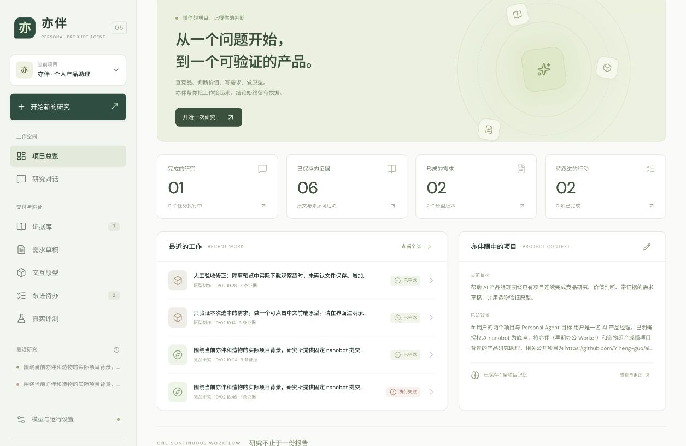
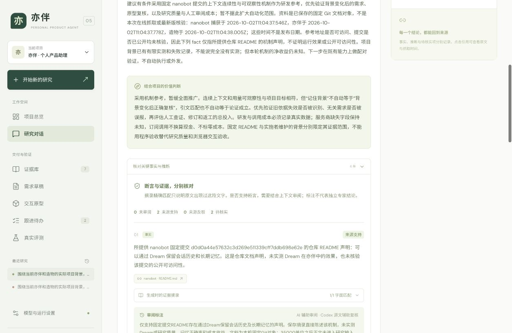
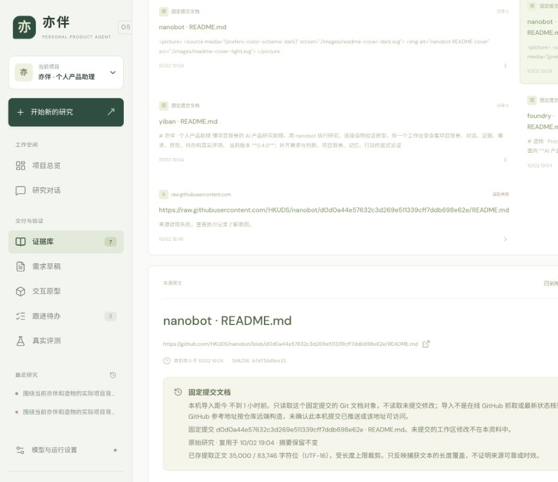
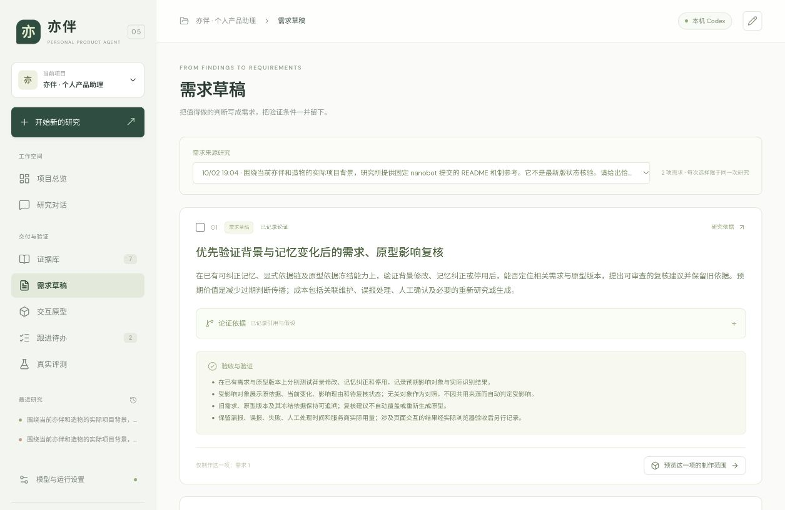
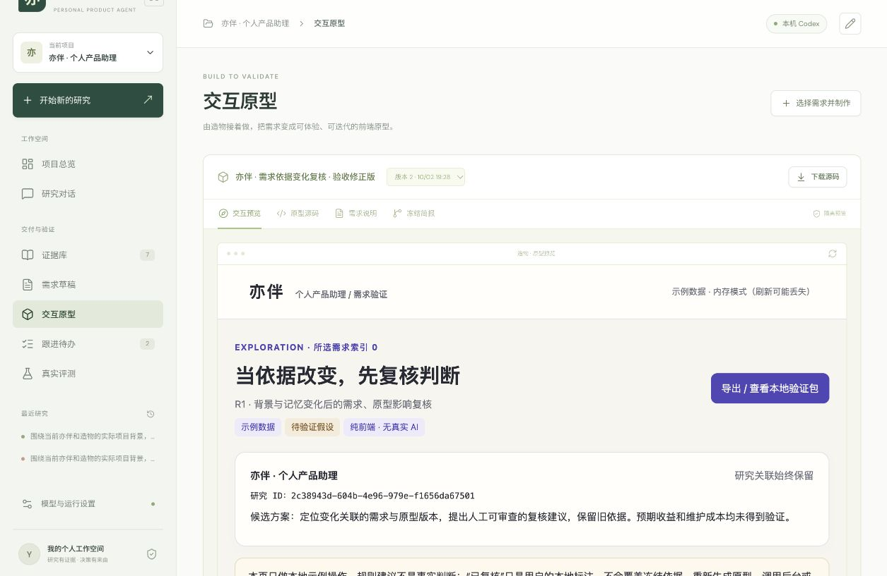
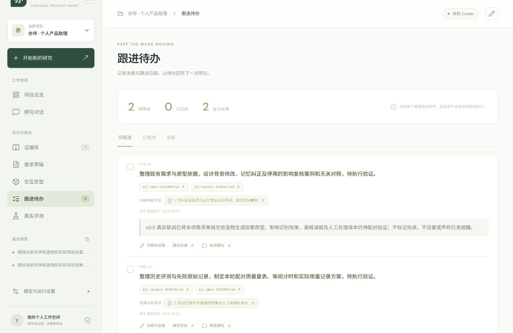

# 亦伴公开演示

此目录是无需模型授权的静态演示：六张真实页面实拍，加上一份可点击的探索原型。它不包含工作空间数据库、模型授权、私人会话或完整运行日志。

第一次克隆完整产品不会恢复作者数据库或历史实测；演示中的已保存结果只通过图片与公开原型呈现，需要你在自己的工作空间建立项目。

- [演示页面源码](index.html)：下载仓库后可双击打开；GitHub 文件预览不会执行 HTML。
- [交互探索原型源码](prototype.html)：可双击打开，模拟依据变化、人工复核和 JSON 导出。
- [完整产品本机启动](../PUBLIC_DEMO.md)：需要两个仓库和自己的模型授权。

## 六步真实案例

以下图片来自 2026-10-02 的本机 v0.5 已保存案例。研究使用固定 Git 提交文档，没有宣称重新在线核验。

| 步骤 | 实际呈现 | 边界 |
|---|---|---|
| 项目背景 | 目标、范围、确认记忆和最近工作 | 记忆需要确认，可以更正或停用 |
| 研究判断 | 4 条主张，区分事实、推断和未知 | 引文匹配不等于独立准确率 |
| 来源证据 | 3 份固定提交文档，保留时间和哈希 | 导入时间不是发布日期，正文存在截断 |
| 需求草稿 | 2 条候选需求，显式连接论证和验证 | 草稿不等于已接受或已实现的需求 |
| 原型验证 | 仅采用第 1 条需求，保存 2 个版本 | 示例业务数据，纯前端，无模型调用 |
| 跟进待办 | 2 条待执行行动与实际进展 | 没有离线自动提醒，不把待验证任务标为完成 |













## 交互原型来源

原型围绕需求 R1“优先验证背景与记忆变化后的需求、原型影响复核”探索，由造物通过真实模型生成第 1 版。实施者随后修正导出体验：增加完整 JSON 查看、选中和下载回退，第 2 版不是一次新模型生成。公开副本保留第 2 版原始 HTML，不改变机制、数据或研究结论。

`prototype.html` 的 SHA256：

```text
ba08b4c814c76b0e4e8c2a263f37923e04290b62849a03e0855ed6ca7b5302e2
```

原型只对示例对象的显式依赖提出复核建议，不做语义判断。两项关联对象及无关对照是演示构造，不能当成真实项目对象或评测结果。人工验证表单中的数字由操作者填写，不是自动测量。

来源引用指向 [nanobot 固定 README](https://github.com/HKUDS/nanobot/blob/d0d0a44e57632c3d269e511339cff7ddb698e62e/README.md)、亦伴与造物的历史 README；快照保持原始提交和哈希，不改写成新版。原型未嵌入完整来源正文，公开引用地址是否可访问以实际访问结果为准。

## 离线与静态托管

双击 `index.html` 可以切换图片，打开 `prototype.html` 进行本地交互；两个页面不请求研究 API。也可以在仓库根目录启动：

```bash
python3 -m http.server 8080 --directory docs/demo
```

随后打开 `http://127.0.0.1:8080`。这一地址仅供本机使用；只有仓库启用 GitHub Pages 等静态托管后，才有可分享的公网地址。

浏览器允许时，原型数据保存在当前站点的 `localStorage`；存储不可用时使用内存，刷新可能丢失。导出会提供完整 JSON 文本，文件下载是否成功以浏览器实际保存为准。静态站没有后台，也不会将表单内容上传给作者；完整产品的运行与存储另见本机启动说明。
